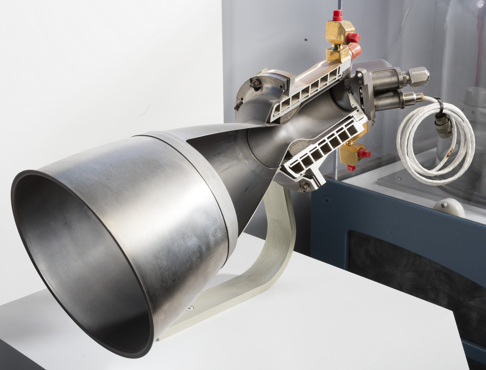
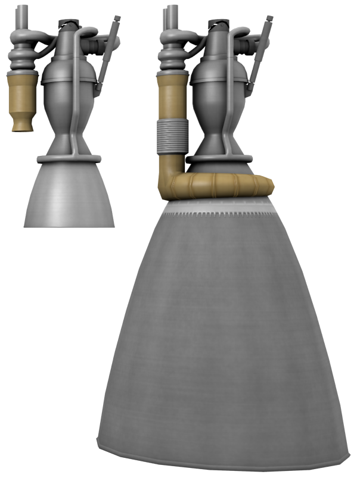

Nozzle Flow
***********

Nozzle flow theory can predict the thrust and specific impulse of a rocket engine. The following example predicts the performance of an engine which operates at chamber pressure of 10 MPa, chamber temperature of 3000 K, and has 100 mm diameter nozzle throat.

.. literalinclude:: examples/thrust_isp.py 

Output:

.. literalinclude:: examples/thrust_isp_output.txt

The rest of this page derives the nozzle flow theory, and demonstrates other features of ``proptools.nozzle``.

Ideal Nozzle Flow
=================

The purpose of a rocket is to generate thrust by expelling mass at high velocity. The rocket nozzle is a flow device which accelerates gas to high velocity before it is expelled from the vehicle. The nozzle accelerates the gas by converting some of the gas's thermal energy into kinetic energy.

Ideal nozzle flow is a simplified model of the aero- and thermo-dynamic behavior of fluid in a nozzle. The ideal model allows us to write algebraic relations between an engine's geometry and operating conditions (e.g. throat area, chamber pressure, chamber temperature) and its performance (e.g. thrust and specific impulse). These equations are fundamental tools for the preliminary design of rocket propulsion systems.

The assumptions of the ideal model are:

#. The fluid flowing through the nozzle is gaseous.
#. The gas is homogeneous, obeys the ideal gas law, and is calorically perfect. Its molar mass (:math:`\mathcal{M}`) and heat capacities (:math:`c_p, c_v`) are constant throughout the fluid, and do not vary with temperature.
#. There is no heat transfer to or from the gas. Therefore, the flow is adiabatic. The specific enthalpy :math:`h` is constant throughout the nozzle.
#. There are no viscous effects or shocks within the gas or at its boundaries. Therefore, the flow is reversible. If the flow is both adiabatic and reversible, it is isentropic: the specific entropy :math:`s` is constant throughout the nozzle.
#. The flow is steady; :math:`\frac{d}{dt} = 0`.
#. The flow is quasi one dimensional. The flow state varies only in the axial direction of the nozzle.
#. The flow velocity is axially directed.
#. The flow does not react in the nozzle. The chemical equilibrium established in the combustion chamber does not change as the gas flows through the nozzle. This assumption is known as "frozen flow".

These assumptions are usually acceptably accurate for preliminary design work. Most rocket engines perform within 1% to 6% of the ideal model predictions [RPE]_.

Isentropic Relations
====================
Under the assumption of isentropic flow and calorically perfect gas, there are several useful relations between fluid states. These relations depend on the heat capacity ratio, :math:`\gamma = c_p /c_v`. Consider two gas states, 1 and 2, which are isentropically related (:math:`s_1 = s_2`). The states' pressure, temperature and density ratios are related:

.. math::

  \frac{p_1}{p_2} = \left( \frac{\rho_1}{\rho_2} \right)^\gamma = \left( \frac{T_1}{T_2} \right)^{\frac{\gamma}{\gamma - 1}}

Stagnation state
----------------

Now consider the relation between static and stagnation states in a moving fluid. The stagnation state is the state a moving fluid would reach if it were isentropically decelerated to zero velocity. The stagnation enthalpy :math:`h_0` is the sum of the static enthalpy and the specific kinetic energy:

.. math::

  h_0 = h + \frac{1}{2} v^2

For a calorically perfect gas, :math:`T = h / c_p`, and the stagnation temperature is:

.. math::

  T_0 = T + \frac{v^2}{2 c_p}

It is helpful to write the fluid properties in terms of the Mach number :math:`M`, instead of the velocity. Mach number is the velocity normalized by the local speed of sound, :math:`a = \sqrt{\gamma R T}`. In terms of Mach number, the stagnation temperature is:

.. math::
  T_0 = T \left( 1 + \frac{\gamma - 1}{2} M^2 \right)

Because the static and stagnation states are isentropically related, :math:`\frac{p_0}{p} = \left( \frac{T_0}{T} \right)^{\frac{\gamma}{\gamma - 1}}`. Therefore, the stagnation pressure is:

.. math::
  p_0 = p \left( 1 + \frac{\gamma - 1}{2} M^2 \right)^{\frac{\gamma}{\gamma - 1}}

Use ``proptools`` to plot the stagnation state variables against Mach number:

TODO code example

Exit velocity
-------------

The exit velocity of the exhaust gas is the fundamental measure of efficiency for rocket propulsion systems, as the `rocket equation <https://en.wikipedia.org/wiki/Tsiolkovsky_rocket_equation>`_ shows. We can now show a basic relation between the exit velocity and the combustion conditions of the rocket. First, use the conservation of energy to relate the velocity at any two points in the flow:

.. math::

  v_2 = \sqrt{2(h_1 - h_2) + v_1^2}

We can replace the enthalpy difference with an expression of the pressures and temperatures, using the isentropic relations.

.. math::

  v_2 = \sqrt{\frac{2 \gamma}{\gamma - 1} R T_1 \left(1 - \left( \frac{p_2}{p_1} \right)^{\frac{\gamma - 1}{\gamma}} \right) + v_1^2}

Set state 1 to be the conditions in the combustion chamber: :math:`T_1 = T_c, p_1 = p_c, v_1 \approx 0`. Set state 2 to be the state at the nozzle exit: :math:`p_2 = p_e, v_2 = v_e`. This gives the exit velocity:

.. math::

  v_e &= \sqrt{\frac{2 \gamma}{\gamma - 1} R T_c \left(1 - \left( \frac{p_e}{p_c} \right)^{\frac{\gamma - 1}{\gamma}} \right)} \\
  &= \sqrt{\frac{2 \gamma}{\gamma - 1} \mathcal{R} \frac{T_c}{\mathcal{M}} \left(1 - \left( \frac{p_e}{p_c} \right)^{\frac{\gamma - 1}{\gamma}} \right)}

.. math::

  \require{siunitx}

where :math:`\mathcal{R} = 8.314` J mol :sup:`-1` K :sup:`-1` is the universal gas constant and :math:`\mathcal{M}` is the molar mass of the exhaust gas. Temperature and molar mass have the most significant effect on exit velocity. To maximize exit velocity, a rocket should burn propellants which yield a high flame temperature and low molar mass exhaust. This is why many rockets burn hydrogen and oxygen: they yield a high flame temperature, and the exhaust (mostly H\ :sub:`2` and H\ :sub:`2`\ O) is of low molar mass.

The pressure ratio :math:`p_e / p_c` is usually quite small. As the pressure ratio goes to zero, the exit vleocity approaches its maximum for a given :math:`T_c, \mathcal{M}` and :math:`\gamma`.

.. math::
  \frac{p_e}{p_c} \rightarrow 0 \quad \Rightarrow \quad 1 - \left( \frac{p_e}{p_c} \right)^{\frac{\gamma - 1}{\gamma}} \rightarrow 1

If :math:`p_e \ll p_c`, the pressures have a weak effect on exit velocity. 

The heat capacity ratio :math:`\gamma` has a weak effect on exit velocity. Decreasing :math:`\gamma` increases exit velocity.

TODO code example

Mach-Area Relation
==================

Using the isentropic relations, we can find how the Mach number of the flow varies with the cross sectional area of the nozzle. This allows the design of a nozzle geometry which will accelerate the flow the high speeds needed for rocket propulsion.

Start with the conservation of mass. Because the flow is quasi- one dimensional, the mass flow through every cross-section of the nozzle must be the same:

.. math::

  \dot{m} = A v \rho = \mathrm{const}

where :math:`A` is the cross-sectional area of the nozzle flow passage (normal to the flow axis). To conserve mass, the ratio of areas between any two points along the nozzle axis must be:

.. math::

  \frac{A_1}{A_2} = \frac{v_2 \rho_2}{v_1 \rho_1}

Use the isentropic relations to write the velocity and density in terms of Mach number, and simplify:

.. math::
  
  \frac{A_1}{A_2} = \frac{M_2}{M_1} \left( \frac{1 + \frac{\gamma - 1}{2} M_1^2}{1 + \frac{\gamma - 1}{2} M_2^2} \right)^{\frac{\gamma + 1}{2 (\gamma - 1)}}

We can use ``proptools`` to plot Mach-Area relation. Let :math:`M_2 = 1` and plot :math:`A_1 / A_2` vs :math:`M_1`:

.. plot:: examples/plots/mach_area.py
  :include-source:
  :align: center

We see that the nozzle area has a minimum at :math:`M = 1`. At subsonic speeds, Mach number increases as the area is decreased. At supersonic speeds (:math:`M > 1`), Mach number increases as area increases. For a flow passage to accelerate gas from subsonic to supersonic speeds, it must first decrease in area, then increase in area. Therefore, most rocket nozzles have a convergent-divergent shape. Larger expansions of the divergent section lead to higher exit Mach numbers.

  The typical converging-diverging shape of rocket nozzles is shown in this cutaway of the Thiokol C-1 engine. Image  credit: `Smithsonian Institution, National Air and Space Museum <https://airandspace.si.edu/collection-objects/rocket-engine-liquid-fuel-radiamic-cutaway-also-designated-c-1>`_

Choked Flow
===========

The station of minimum area in a converging-diverging nozzle is known as the *nozzle throat*. If the pressure ratio across the nozzle is at least:

.. math::

  \frac{p_c}{p_e} > \left( \frac{\gamma + 1}{2} \right)^{\frac{\gamma}{\gamma - 1}} \sim 1.8

then the flow at the throat will be sonic (:math:`M = 1`) and the flow in the diverging section will be supersonic. The velocity at the throat is:

.. math::

  v_t = \sqrt{\gamma R T_t} = \sqrt{\frac{2 \gamma}{\gamma + 1} R T_c}

The mass flow at the sonic throat (i.e. through the nozzle) is:

.. math::

  \dot{m} = A_t v_t \rho_t = A_t p_c \frac{\gamma}{\sqrt{\gamma R T_c}} \left( \frac{2}{\gamma + 1} \right)^{\frac{\gamma + 1}{2 (\gamma - 1)}}

Notice that the mass flow does not depend on the exit pressure. If the exit pressure is sufficiently low to produce sonic flow at the throat, the nozzle is *choked* and further decreases in exit pressure will not alter the mass flow. Increasing the chamber pressure increases the density at the throat, and therefore will increase the mass flow which can "fit through" the throat. Increasing the chamber temperature increases the throat velocity but decreases the density by a larger amount; the net effect is to decrease mass flow as :math:`1 / \sqrt{T_c}`.

TODO add mass flow and is_choked code example

Thrust
======

The thrust force of a rocket engine is equal to the momentum flow out of the nozzle plus a pressure force at the nozzle exit:

.. math::

  F = \dot{m} v_e + (p_e - p_a) A_e

where :math:`p_a` is the ambient pressure and :math:`A_e` is the nozzle exit area. We can rewrite this in terms of the chamber pressure:

.. math::

  F = A_t p_c \sqrt{\frac{2 \gamma^2}{\gamma - 1} \left( \frac{2}{\gamma + 1}\right)^{\frac{\gamma + 1}{\gamma - 1}} \left(1 - \left( \frac{p_e}{p_c} \right)^{\frac{\gamma - 1}{\gamma}} \right)} + (p_e - p_a) A_e

Note that thrust depends only on :math:`\gamma` and the nozzle pressures and areas; not chamber temperature.

Use ``proptools`` to plot thrust versus chamber pressure for the example engine:

TODO create a thrust function instead of using C_f

.. plot:: examples/plots/thrust_pc.py
  :include-source:
  :align: center

Note that thrust is almost linear in chamber pressure.

We can also explore the variation of thrust with ambient pressure for fixed :math:`p_c, p_e`:

TODO add altitude dual axis

.. plot:: examples/plots/thrust_pa.py
  :include-source:
  :align: center

Thrust coefficient
==================
We can normalize thrust by :math:`A_t p_c` to give a non-dimensional measure of nozzle efficiency, which is independent of engine size or power level. This is the *thrust coefficient*, :math:`C_F`:

.. math::

  C_F \equiv \frac{F}{A_t p_c}

For an ideal nozzle, the thrust coefficient is:

.. math::

  C_F = \sqrt{\frac{2 \gamma^2}{\gamma - 1} \left( \frac{2}{\gamma + 1}\right)^{\frac{\gamma + 1}{\gamma - 1}} \left(1 - \left( \frac{p_e}{p_c} \right)^{\frac{\gamma - 1}{\gamma}} \right)} + \frac{p_e - p_a}{p_c} \frac{A_e}{A_t}

Note that :math:`C_F` is independent of the combustion temperature or the engine size. It depends only on the heat capacity ratio, nozzle pressures, and expansion ratio (:math:`A_e / A_t`). Therefore, :math:`C_F` is a figure of merit for the nozzle expansion process. It can be used to compare the efficiency of different nozzle designs on different engines. Values of :math:`C_F` are generally between 0.8 and 2.2, with higher values indicating better nozzle performance. 

Expansion Ratio
===============

The expansion ratio is an important design parameter which affects nozzle efficiency. It is the ratio of exit area to throat area:

.. math::

  \epsilon \equiv \frac{A_e}{A_t}

The expansion ratio appears directly in the equation for thrust coefficient. The expansion ratio also allows the nozzle designer to set the exit pressure. The relation between expansion ratio and pressure ratio can be found from mass conservation and the isentropic relations:

.. math::

  \epsilon &= \frac{A_e}{A_t} = \frac{\rho_t v_t}{\rho_e v_e} \\
  &= \left( \frac{\gamma + 1}{2} \right)^{\frac{1}{\gamma - 1}} \left( \frac{p_e}{p_c} \right)^{\frac{1}{\gamma}} \sqrt{\frac{\gamma + 1}{\gamma - 1} \left(1 - \left( \frac{p_e}{p_c} \right)^{\frac{\gamma - 1}{\gamma}} \right)}

This relation is implemented in ``proptools``:

.. literalinclude:: examples/expansion_ratio.py

.. literalinclude:: examples/expansion_ratio_output.txt

We can also easily solve the inverse problem with `scipy.optimize.fsolve <https://docs.scipy.org/doc/scipy/reference/generated/scipy.optimize.fsolve.html>`_:

.. literalinclude:: examples/expansion_ratio_inverse.py

.. literalinclude:: examples/expansion_ratio_inverse_output.txt

Let us plot the effect of expansion ratio on thrust coefficient:

.. plot:: examples/plots/exp_ratio_cf.py
  :include-source:
  :align: center

The thrust coefficient is maximized at the *matched expansion condition*, where :math:`p_e = p_a`. Therefore, nozzle designers select the expansion ratio based on the ambient pressure which the engine is expected to operate in. Small expansion ratios are used for space launch boosters or tactical missiles, which operate at low altitudes (high ambient pressure). Large expansion ratios are used for second stage or orbital maneuvering engines, which operate in the vacuum of space.

  This illustration shows two variants of an engine family, one designed for a first stage booster (left) and the other for a second stage (right). The first stage (e.g. sea level) engine has a smaller expansion ratio than the second stage (e.g. vacuum) engine. Image credit: `shadowmage <https://forum.kerbalspaceprogram.com/index.php?/profile/138730-shadowmage/>`_.

TODO replicate RPE figure 3-10

Characteristic velocity
=======================

We can define another performance parameter which captures the effects of the combustion gas which is supplied to the nozzle. This is the *characteristic velocity*, :math:`c^*`:

.. math::

  c^* \equiv \frac{A_t p_c}{\dot{m}}

For an ideal rocket, the characteristic velocity is:

.. math::

  c^* = \frac{\sqrt{\gamma R T_c}}{\gamma} \left( \frac{\gamma + 1}{2} \right)^{\frac{\gamma + 1}{2 (\gamma - 1)}}

The characteristic velocity depends only on the exhaust properties (:math:`\gamma, R`) and the combustion temperature. It is therefore a figure of merit for the combustion process and propellants. :math:`c^*` is independent of the nozzle expansion process.

The ideal :math:`c^*` of the example engine is:

.. literalinclude:: examples/c_star_ideal.py

.. literalinclude:: examples/c_star_ideal_output.txt

Specific Impulse
================

Finally, we arrive at *specific impulse*, the most important performance parameter of a rocket engine. The specific impulse is the ratio of thrust to the rate of propellant consumption:

.. math::

  I_{sp} \equiv \frac{F}{\dot{m} g_0}

For historical reasons, specific impulse is normalized by the constant :math:`g_0 =` 9.807 m s :sup:`-2` , and has units of seconds. For an ideal rocket at matched exit pressure, :math:`I_{sp} = v_2 / g_0`.

The specific impulse measures the "fuel efficiency" of a rocket engine. The specific impulse and propellant mass fraction together determine the delta-v capability of a rocket.

Specific impulse is the product of the thrust coefficient and the characteristic velocity. The overall efficiency of the engine (:math:`I_{sp}`) depends on both the combustion gas (:math:`c^*`) and the efficiency of the nozzle expansion process (:math:`C_F`).

.. math::

  I_{sp} = \frac{c^* C_F}{g_0}

.. [RPE] G. P. Sutton and O. Biblarz, *Rocket Propulsion Elements*, Hoboken: John Wiley & Sons, 2010.
