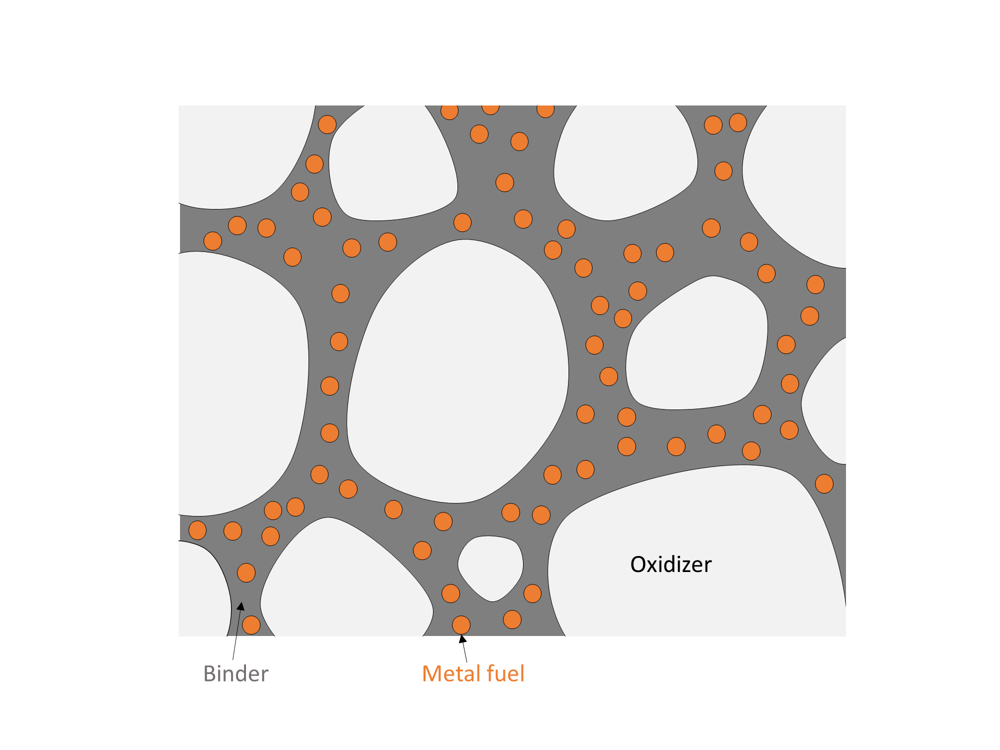
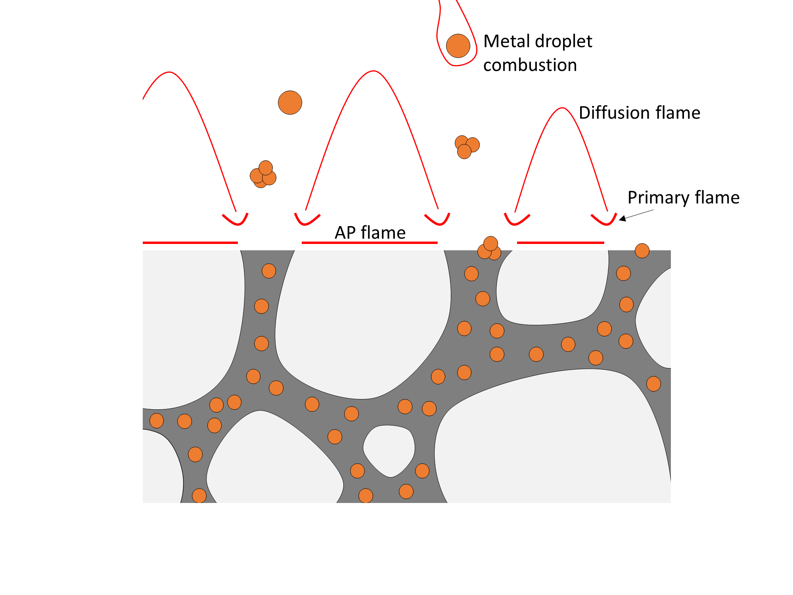

Solid-Propellant Rocket Motors
******************************

Solid propellant rocket motors store propellant as a solid grain within the combustion chamber. When the motor is ignited, the surfaces of the propellant grain burn and produce hot gas, which is expelled from the chamber through a nozzle to produce thrust.

However, in most solid rocket motors, no mechanism exists to control the chamber pressure and thrust during flight. Rather, the chamber pressure of a solid rocket motor arises from an equilibrium between exhaust generation from combustion and exhaust discharge through the nozzle.

The rest of this page reviews the fundamentals solid propellants, and demonstrates the use of ``proptools.solid`` to predict the performance of a solid rocket motor.

Applications of Solid Rocket Motors
===================================

Compared to liquid-propellant rocket engines, solid propellant motors are mechanically simpler, require less support equipment and time to prepare for launch, and can be stored for long times loaded and ready for launch. Therefore, solid motors are preferred for most military applications, which may need to be fired from mobile launchers (e.g. tactical missiles) or be quickly ready for launch after many years of storage (e.g. strategic missiles). The mechanical simplicity of solid motors is also favors their use in some space-launch applications.

Propellant Ingredients
======================

Chemical requirements of solid propellants
------------------------------------------

A solid propellant contains both fuel and oxidizer mixed together. This is different from most other combustion systems, where the fuel and oxidizer are only mixed just before combustion (e.g. internal combustion engines, torches, liquid bi-propellant rocket engines). This poses a chemistry challenge: the propellant ingredients must react energetically with each other, but also be safely stored and handled while mixed together. Clearly, a formulation which spontaneously ignites during mixing has no practical value as a storable solid propellant. A propellant must also not ignite when exposed to mechanical shock, heat or electrostatic discharges during handling. A propellant which is resistant to these accidental ignition sources is said to have low sensitivity. In chemical terms, low sensitivity roughly requires that the combustion reaction have high activation energy.

A further difference between solid rocket motors and most other combustion devices is that the motor contains all its propellant in the combustion chamber, rather than gradually injecting it as it is to be burned. This means that the rate of propellant consumption is not governed by a throttle or injector, but by the chemical dynamics of the combustion reaction. The propellant must burn at a stable and predictable rate. Ingredient sets which react very quickly may be useful as explosives, but not as propellants.

In summary, the choice of ingredients must produce a solid propellant which:

#. stores a large amount of chemical potential energy, and reacts to provide hot gas for propulsion
#. is resistant to accidental ignition during production, storage and handling
#. burns at a stable and predictable rate

Ammonium perchlorate composite propellant
-----------------------------------------

Ammonium perchlorate composite propellant (APCP) is the most-used solid propellant composition in space launch applications (e.g. the Space Shuttle’s Reusable Solid Rocket Motor, Orbital ATK’s Star motor series). APCP is energetic (up to ~270 seconds of specific impulse), is resistant to accidental ignition, and will burn stably in a properly designed motor.

APCP contains a solid oxidizer (ammonium perchlorate) and (optionally) a powdered metal fuel, held together by a rubber-like binder. Ammonium perchlorate is a crystalline solid, which divided into small particles (10 to 500 μm) and dispersed though the propellant. During combustion, the ammonium perchlorate decomposes to produce a gas rich in oxidizing species. A polymer matrix, the binder, binds the oxidizer particles together, giving the propellant mechanical strength. The binder serves as a fuel, giving off hydrocarbon vapors during combustion. Additional fuel may be added as hot-burning metal powder dispersed in the binder.

  A composite propellant consists of crystalline oxidizer particles, and possibly a metal fuel powder, dispersed in a polymer binder.

Combustion Process
==================

The combustion process of a composite propellant has many steps, and the flame structure is complex. Although the propellant is a solid, important reactions, including combustion of the fuel with the oxidizer, occur in the gas phase. A set of flames hover over the surface of the burning propellant. These flames transfer heat to the propellant surface, causing its solid components to decompose into gases. The gaseous decomposition products contain fuel vapor and oxidizing species, which supply the flames with reactants.

Importantly, the combustion process contains a feedback loop. Heat from the flames vaporizes the surface, and vapor from the surface provides fuel and oxidizer to the flames. The rate at which this process proceeds depends on chemical kinetics, mass transfer, and heat transfer within the combustion zone. Importantly, the feedback rate depends on pressure. As we will see in the next section, the rate of propellant combustion determines the chamber pressure and thrust of a solid rocket motor.

  The typical flame structure of composite propellant combustion. Heat from the flames decomposes the ammonium perchlorate and binder, which in turn supply oxidizing (AP) and fuel (binder) gases to the flames.

Effect of pressure on burn rate
-------------------------------

The flame structure described above causes the propellant to burn faster at higher pressures. At higher pressures, the gas phase is denser, causing reactions and diffusion to proceed more quickly. This moves the flame structure closer to the surface. The closer flames and denser conducing medium enhance heat transfer to the surface, which drives more decomposition, increasing the burn rate.

Although this dependence is complicated, it can be empirically described by Vieille’s Law, which relates the burn rate :math:`r` to the chamber pressure :math:`p_c` via two parameters:

.. math::

  r = a (p_c )^n

:math:`r` is the rate at which the surface regresses, and has units of velocity. :math:`a` is the burn rate coefficient, which has units of [velocity (pressure) :sup:`-n`]. :math:`n` is the unitless burn rate exponent. The model parameters :math:`a, n` must be determined by combustion experiments on the propellant.

Motor Internal Ballistics
=========================

The study of propellant combustion and fluid dynamics within a rocket motor is called internal ballistics. Internal ballistics can be used to estimate the chamber pressure and thrust of a motor.

Equilibrium chamber pressure
----------------------------
The operating chamber pressure of a solid motor is set by an equilibrium between exhaust generation from combustion and exhaust discharge through the nozzle.
The chamber pressure of a solid rocket motor is related to the mass of combustion gas in the chamber by the Ideal Gas Law:

.. math::
  
  p_c = m R T_c \frac{1}{V_c}

where :math:`R` is the specific gas constant of the combustion gases in the chamber, :math:`T_c` is their temperature, and :math:`V_c` is the chamber volume. Gas mass is added to the chamber by burning propellant, and mass flows out of the chamber through the nozzle. The rate of change of the chamber gas mass is:

.. math::

  \frac{d m}{d t} = \dot{m}_{combustion} - \dot{m}_{nozzle}

Ideal nozzle theory relates the mass flow through the nozzle to the chamber pressure and the :ref:`characteristic_velocity-tutorial-label`:

.. math::

  \dot{m}_{nozzle} = \frac{p_c A_t}{c^*}

The rate of gas addition from combustion is:

.. math::

  \dot{m}_{combustion} = A_b \rho_s r(p_c)

where :math:'A_b' is the burn area of the propellant, :math:`\rho_s` is the density of the solid propellant, and :math:`r(p_c)` is the burn rate (a function of chamber pressure).

At the equilibrium chamber pressure where the inflow and outflow rates are equal:

.. math::

  \frac{d m}{d t} = \dot{m}_{combustion} - \dot{m}_{nozzle} = 0

.. math::

  A_b \rho_s r(p_c) = \frac{p_c A_t}{c^*}

.. math::
 
  p_c &= \frac{A_b}{A_t} \rho_s c^* r(p_c) \\
  &= K \rho_s c^* r(p_c)

where :math:`K \equiv \frac{A_b}{A_t}` is ratio of burn area to throat area. If the propellant burn rate is well-modeled by Vieille's Law, the equilibrium chamber pressure can be solved for in closed form:

.. math::

  p_c = \left( K \rho_s c^* a \right)^{\frac{1}{1 - n}}

Consider an example motor. The motor burns a relatively slow-burning propellant with the following properties:

- Burn rate exponent of 0.5, and a burn rate of 2.54 mm s :sup:`-1` at 6.9 MPa
- Exhaust ratio of specific heats of 1.26
- Characteristic velocity of 1209 m s :sup:`-1`
- Solid density of 1510 kg m :sup:`-3`

The motor has a burn area of 1.25 m :sup:`2`, and a throat area of 839 mm :sup:`2` (diameter of 33 mm).

Plot the combustion and nozzle mass flow rates versus pressure:

.. plot:: examples/solid/plots/equilibrium_pressure.py
  :include-source:
  :align: center

The nozzle and combustion mass flow rates are equal at 6.9 MPa: this is the equilibrium pressure of the motor. This equilibrium is stable:

 - At lower pressures, the combustion mass addition rate is higher than the nozzle outflow rate, so the mass of gas in the chamber will increase and the pressure will rise to the equilibrium value.
 - At higher pressures, the combustion mass addition rate is lower than the nozzle outflow rate, so the mass of gas in the chamber will decrease and the pressure will fall to the equilibrium value.

In general, a stable equilibrium pressure will exist for propellants with :math:`n < 1` (i.e. burn rate is sub-linear in pressure).

We can use proptools to quickly find the chamber pressure and thrust of the example motor:

.. literalinclude:: examples/solid/pressure_and_thrust.py

.. literalinclude:: examples/solid/pressure_and_thrust_output.txt

Burn area evolution and thrust curves
-------------------------------------
